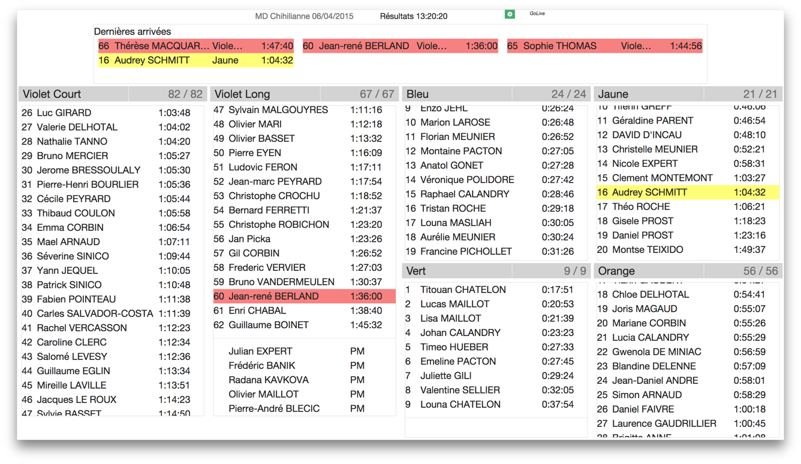

# GoLive

Small Angular app for non-interactive display of live results:

- poll results in json format and refresh
- display each course/set in a column
- autoscroll each column so that all data have a chance to show

## Setup & Run

Typical setup:

- PC for ecard reading / Server with results API `http://liveserver:4567/json/lastresults` (see server.js)
- PC/Server running GoLive - request results from above API
- Clients driving animation screen - request GoLive app

GoLive needs a node.js installation. Commands to run:

    npm install && bower install
    npm start

Open app at `http://localhost:3333`. App is customizable online.

### Todos

**GoLive**

- configurable font size?
- plugins Brunch (minifier...)
- save options in local storage

**Geco**

- customize Spark server (port, route ?)
- deprecate current gecolive
